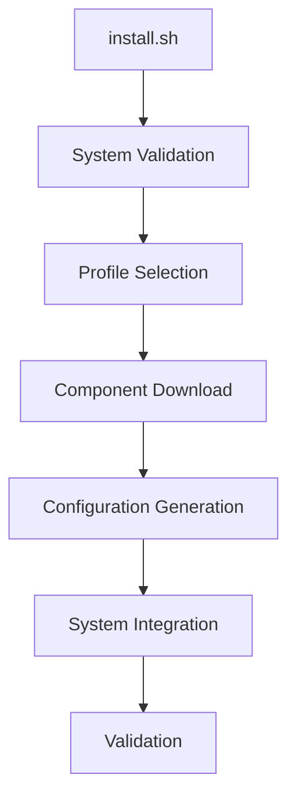
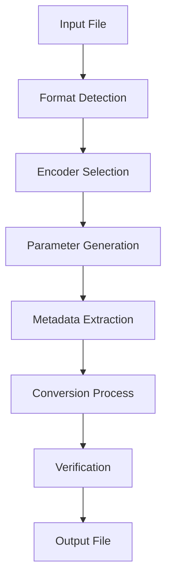
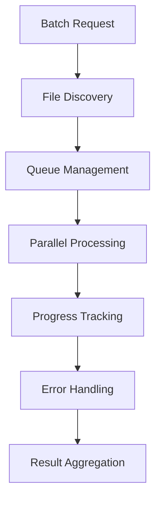
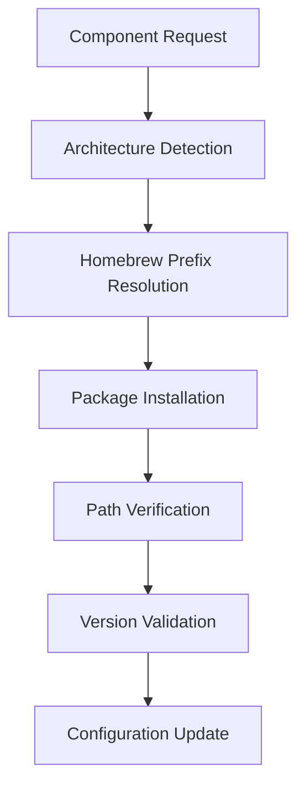
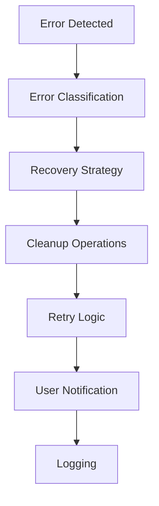
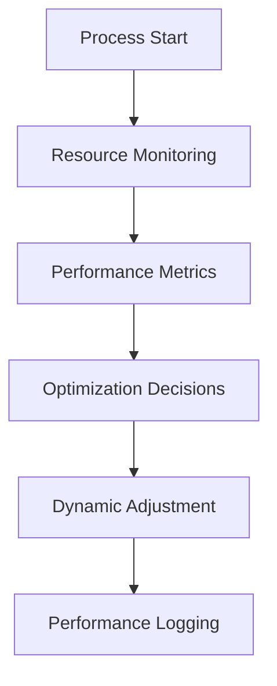
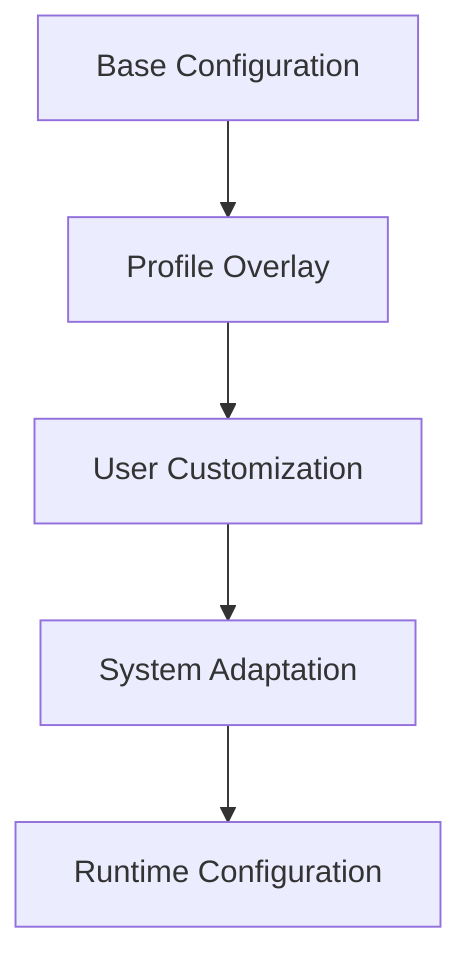
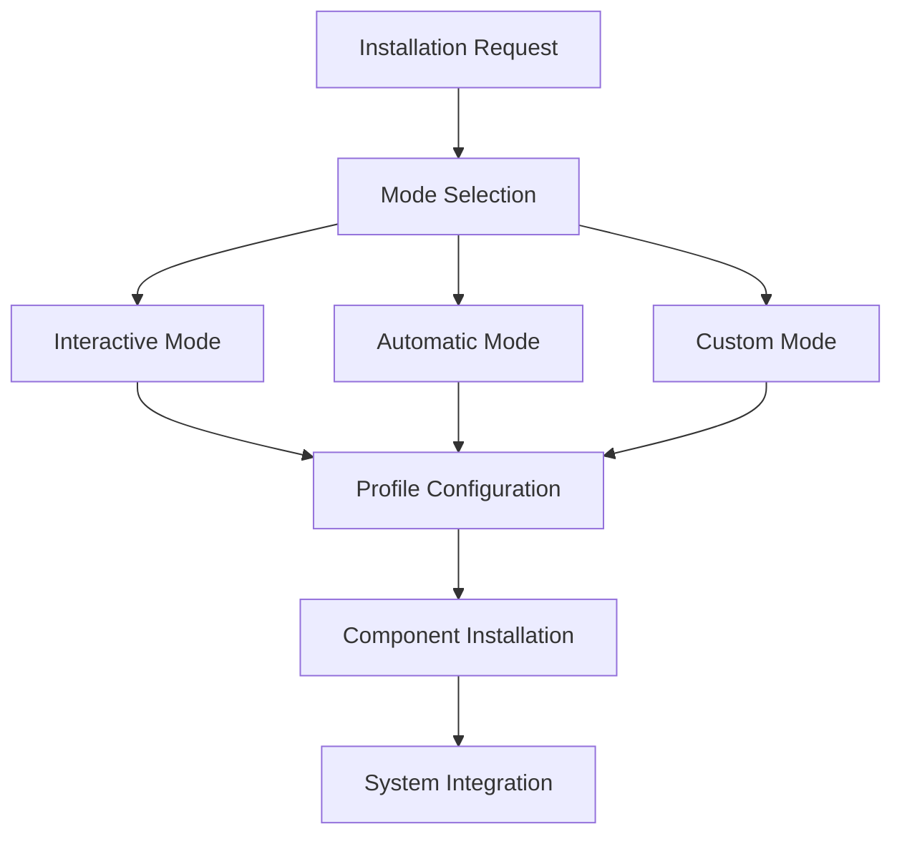
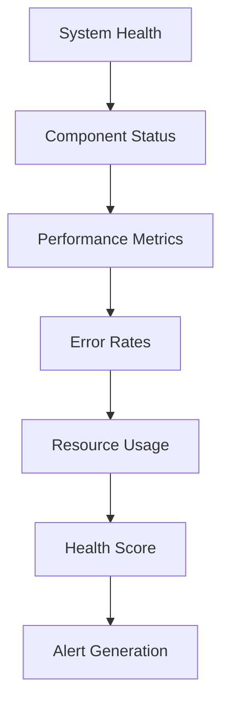

# System Architecture Documentation

Technical architecture and design documentation for the foobar2000 macOS automation system.

## System Overview

The foobar2000 automation system follows a modular, layered architecture designed for extensibility, maintainability, and performance on macOS.

### Architecture Principles

- **Modular Design**: Independent, interchangeable components
- **Cross-Platform Compatibility**: Apple Silicon and Intel support  
- **Shell Agnostic**: Works with bash, zsh, and Fish shells
- **Extensible Profiles**: Configurable installation and operation modes
- **Error Resilient**: Comprehensive error handling and recovery
- **Performance Optimized**: Native architecture utilization

## System Layers

```
┌─────────────────────────────────────────────────────────┐
│                    User Interface Layer                  │
├─────────────────────────────────────────────────────────┤
│  Interactive Menu  │  Fish Functions  │  Direct Scripts  │
├─────────────────────────────────────────────────────────┤
│                    Automation Layer                      │
├─────────────────────────────────────────────────────────┤
│  Conversion Engine │  Batch Processor │  File Monitor    │
├─────────────────────────────────────────────────────────┤
│                   Configuration Layer                    │
├─────────────────────────────────────────────────────────┤
│  Profile Manager   │  Encoder Presets │  System Config   │
├─────────────────────────────────────────────────────────┤
│                    Integration Layer                     │
├─────────────────────────────────────────────────────────┤
│   Homebrew API    │   macOS System   │   foobar2000     │
└─────────────────────────────────────────────────────────┘
```

## Core Components

### Installation System

**Primary Script**: `install.sh`
**Purpose**: Orchestrates complete system setup

#### Component Flow


**Key Features**:
- Architecture detection (Apple Silicon vs Intel)
- Profile-based configuration
- Dependency management
- Error recovery and rollback

### Conversion System

**Primary Script**: `convert_with_external_advanced.sh`
**Purpose**: Advanced audio format conversion with metadata preservation

#### Conversion Flow


**Architecture Components**:
- **Input Validation**: File format and integrity checking
- **Encoder Selection**: Dynamic encoder path resolution
- **Metadata Preservation**: Complete tag and timestamp preservation
- **Error Handling**: Graceful failure with cleanup
- **Logging**: Comprehensive operation tracking

### Configuration Management

**Primary Script**: `config-generator.sh`
**Purpose**: Dynamic configuration generation based on system architecture

#### Configuration Architecture
```
Configuration Sources:
├── System Detection
│   ├── Architecture (ARM64/x86_64)
│   ├── Homebrew Prefix
│   └── Available Encoders
├── Profile Definition
│   ├── Minimal
│   ├── Standard  
│   ├── Professional
│   └── Custom
└── User Preferences
    ├── Quality Settings
    ├── Library Paths
    └── Integration Options
```

**Dynamic Elements**:
- Architecture-specific encoder paths
- Performance-optimized parameters
- Format-specific metadata handling
- Profile-based feature inclusion

## Data Flow Architecture

### File Processing Pipeline


### Batch Processing Architecture



**Batch Processing Features**:
- Parallel conversion support
- Progress indication
- Error isolation
- Resource management
- Automatic cleanup

## System Integration

### macOS System Integration

#### Integration Points
```
macOS Integration:
├── File System
│   ├── Spotlight Metadata
│   ├── QuickLook Support
│   └── File Associations
├── System Services
│   ├── Launch Agents
│   ├── Notification Center
│   └── AppleScript Bridge
└── Hardware Integration
    ├── Media Key Support
    ├── Audio Device Detection
    └── Performance Optimization
```

### Homebrew Integration

#### Package Management Architecture


**Homebrew Integration Features**:
- Automatic architecture detection
- Version compatibility checking
- Path resolution and validation
- Dependency management

## Error Handling Architecture

### Multi-Level Error Handling

```
Error Handling Levels:
├── Input Validation
│   ├── File existence checking
│   ├── Format validation
│   └── Permission verification
├── Process Monitoring
│   ├── Encoder process tracking
│   ├── Resource usage monitoring
│   └── Timeout management
├── Output Verification
│   ├── File integrity checking
│   ├── Format validation
│   └── Metadata verification
└── Recovery Procedures
    ├── Automatic retry logic
    ├── Backup restoration
    └── Cleanup operations
```

### Error Recovery Flow



## Performance Architecture

### Multi-Core Utilization

```
Performance Optimization:
├── Architecture-Specific Optimization
│   ├── Apple Silicon (ARM64)
│   │   ├── Native instruction sets
│   │   ├── Efficient memory usage
│   │   └── Power management
│   └── Intel (x86_64)
│       ├── AVX instruction sets
│       ├── Hyper-threading utilization
│       └── Cache optimization
├── Encoder Optimization
│   ├── Multi-threading support
│   ├── Memory buffer management
│   └── I/O optimization
└── System Resource Management
    ├── CPU scheduling
    ├── Memory allocation
    └── Disk I/O prioritization
```

### Performance Monitoring



## Security Architecture

### Security Layers

```
Security Framework:
├── Input Sanitization
│   ├── Path validation
│   ├── Command injection prevention
│   └── File type verification
├── Process Isolation
│   ├── Separate process execution
│   ├── Resource limiting
│   └── Timeout enforcement
├── File System Security
│   ├── Permission management
│   ├── Temporary file cleanup
│   └── Safe path handling
└── System Integration Security
    ├── Code signing verification
    ├── Gatekeeper compatibility
    └── Sandbox compliance
```

## Extensibility Architecture

### Plugin Architecture

```
Extension Points:
├── Encoder Plugins
│   ├── Custom encoder support
│   ├── Parameter customization
│   └── Format extensions
├── Profile Extensions
│   ├── Custom profiles
│   ├── Quality presets
│   └── Workflow automation
├── Integration Extensions
│   ├── Shell integrations
│   ├── Third-party tool support
│   └── API integrations
└── UI Extensions
    ├── Menu customization
    ├── Function libraries
    └── Alias systems
```

### Configuration Extension



## Deployment Architecture

### Distribution Model

```
Deployment Strategy:
├── Repository-Based Distribution
│   ├── Git clone installation
│   ├── Version control integration
│   └── Update synchronization
├── Component Management
│   ├── Homebrew dependencies
│   ├── System integration
│   └── Configuration deployment
└── Update System
    ├── Incremental updates
    ├── Rollback capability
    └── Validation checks
```

### Installation Modes



## Monitoring and Observability

### Logging Architecture

```
Logging Framework:
├── Structured Logging
│   ├── Timestamp tracking
│   ├── Level categorization
│   └── Component identification
├── Log Aggregation
│   ├── Multi-component logging
│   ├── Centralized storage
│   └── Rotation management
└── Analysis Tools
    ├── Log parsing
    ├── Error correlation
    └── Performance metrics
```

### Health Monitoring



## Future Architecture Considerations

### Scalability Improvements
- Distributed processing capabilities
- Cloud integration support
- Container deployment options

### Enhanced Integration
- Native macOS app development
- Streaming service integration
- AI-powered audio analysis

### Performance Enhancements
- GPU acceleration support
- Machine learning optimization
- Predictive caching systems

This architecture provides a robust, extensible foundation for professional audio processing workflows while maintaining simplicity for end users.